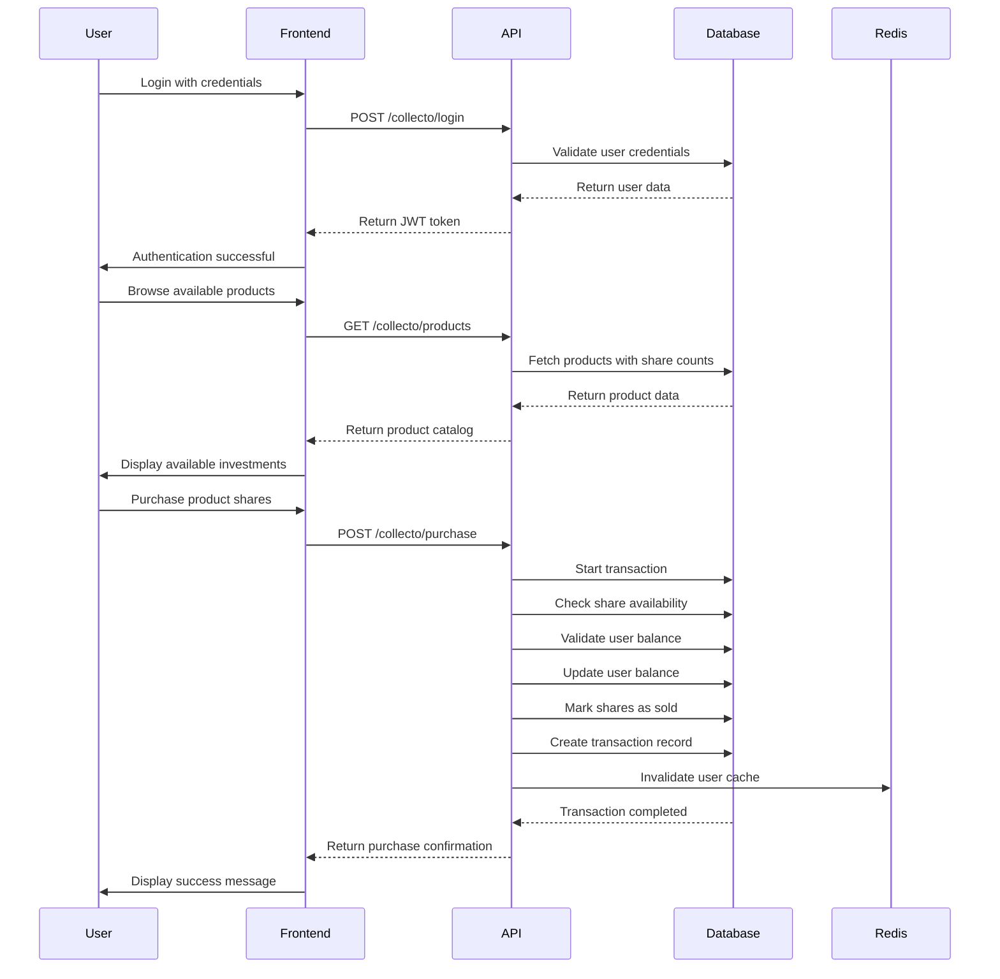

# Collecto App

A sophisticated investment platform that enables users to purchase fractional shares of products through a secure, scalable backend API with Docker containerization and real-time caching.

### Tech Stack

- **Framework:** Node.js with Express.js
- **Language:** TypeScript
- **Database:** MySQL 8.0 with Sequelize ORM
- **Caching:** Redis 6.2
- **Authentication:** JWT (JSON Web Tokens) with bcryptjs
- **API Documentation:** Swagger/OpenAPI
- **Containerization:** Docker & Docker Compose
- **Testing:** Jest with TypeScript support
- **Migration Management:** Sequelize CLI
- **Key Libraries/Services:** Express, Sequelize, Redis, JWT, Swagger

<div align="center" style="display: inline_block justify-center"><br>
   </div>

## 🚀 Main Features

- **Fractional Share Investment** - Purchase partial ownership of products with flexible quantities
- **Secure Authentication** - JWT-based authentication with bcrypt password hashing
- **Real-time Portfolio Management** - View and manage investment collections with Redis caching
- **Transaction Processing** - Atomic database transactions ensuring data consistency
- **API Documentation** - Complete Swagger/OpenAPI documentation for all endpoints
- **Docker Infrastructure** - Containerized deployment with MySQL and Redis services

## 📊 Core Application Flow



## ⚡ How to Run Locally

For detailed setup instructions, please see the [complete setup guide](./README-Setup.md).

1. Clone the repository:

   ```bash
   git clone https://github.com/giacomosalsano/collecto-app.git
   cd collecto-app
   ```

2. Configure environment variables:

   ```bash
   cp .env.example .env
   cp docker.example.env docker.env
   # Update JWT_SECRET in both files
   ```

3. Start the application **(Make sure Docker Desktop is running before proceeding)**:

   ```bash
   npm run docker:fresh && npm run docker:up
   ```

Wait until you see:

```
🚀 Server is running on http://localhost:3000
✅ Connected to Redis.
```

**You're ready to go!**

4. Access the services:
   - **API:** http://localhost:3000
   - **Swagger Docs:** http://localhost:3000/api-docs
   - **MySQL:** localhost:3306
   - **Redis:** localhost:6379

## 📚 Learn More

For full details on architecture, features, components, and improvement suggestions, please see the [complete documentation](./documentation.md).

For Docker-specific commands and troubleshooting, see [Docker Commands Reference](./README-Docker.md).

---

made with ♥ by [giacomosalsano](https://giacomosalsano.com)!
